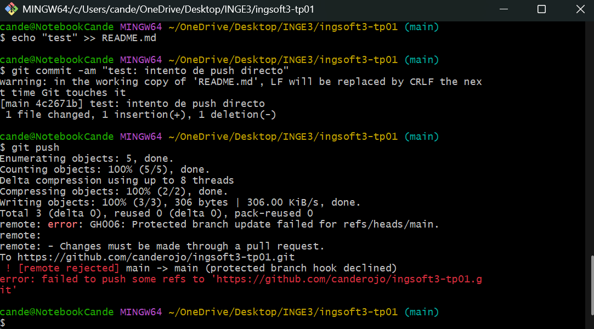
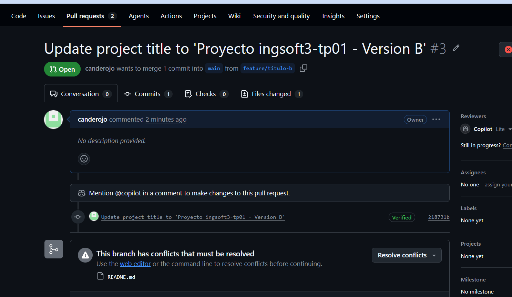
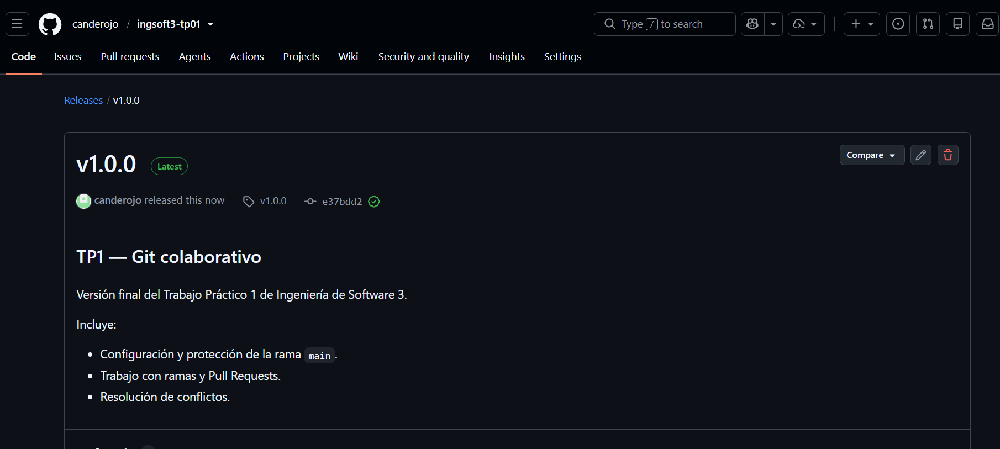

# Evidencias

## 1. Protección de main

Se intentó hacer un push directamente a main. GitHub rechazó el cambio porque la rama está protegida y los cambios deben realizarse mediante un Pull Request.

## 2. Pull Request

Se creó un Pull Request desde feature/seccion-instalacion hacia main para incorporar los cambios realizados.

## 3. Resolución de conflicto

Se generó un conflicto porque dos ramas modificaron el mismo contenido de manera diferente. Se resolvió manualmente eliminando los marcadores de conflicto 

## 4. Release

Se publicó la versión v1.0.0 como Release final del TP1.

